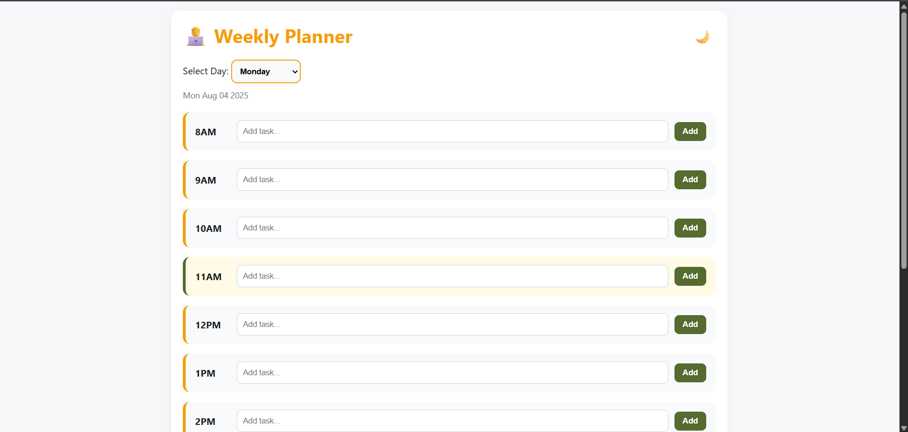

# 🗓️ Weekly Planner

A stylish and responsive **Weekly Planner Web App** to organize your daily tasks by the hour, switch between days, and view a summary of the entire week. Powered by pure HTML, CSS, and JavaScript with `localStorage` for saving data.

---

## ✨ Features

- 🌗 Light/Dark Theme Toggle (with memory)
- 🕗 Hourly Planner (8AM to 5PM)
- ✅ Save Tasks Per Hour
- 🧹 Clear Tasks for Selected Day
- 📋 Weekly Summary Modal
- 📦 Data Persisted in Local Storage
- 🎨 Boyish Theme (charcoal, olive, amber)
- 🧱 Card-based Layout
- 🔄 Smooth Animations
- ⏳ Current Hour Highlight

---

## 📸 Previews

<table>
  <tr>
    <td></td>
    <td></td>
  </tr>
</table>

---

✅ To-Do
 Add card-based layout

 Highlight current hour

 Weekly summary modal

 Theme toggle

 Add authentication (future)

 Cloud sync with account (future)

 ---

 This was for Internship Activity.
